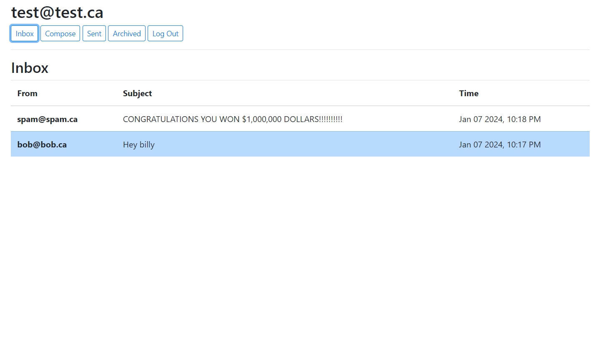
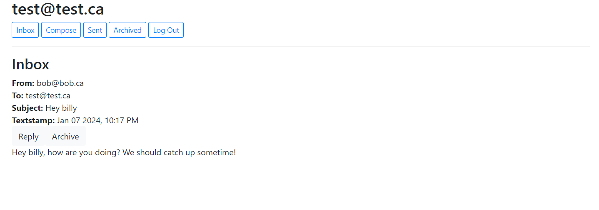

# Gmail-like email application

This project is an email application where users can compose and send emails, read emails they receive, archive emails, and reply to emails. The appearance of this project is inspired by Gmail

This project is built using Django, and the database is managed using SQL.

